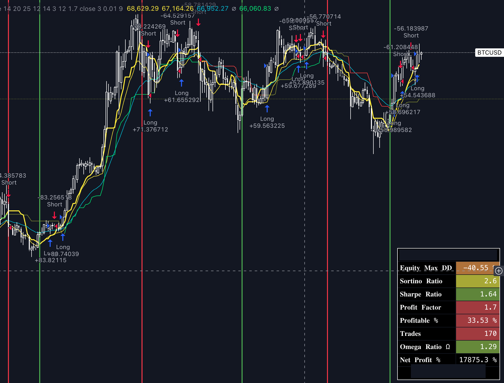
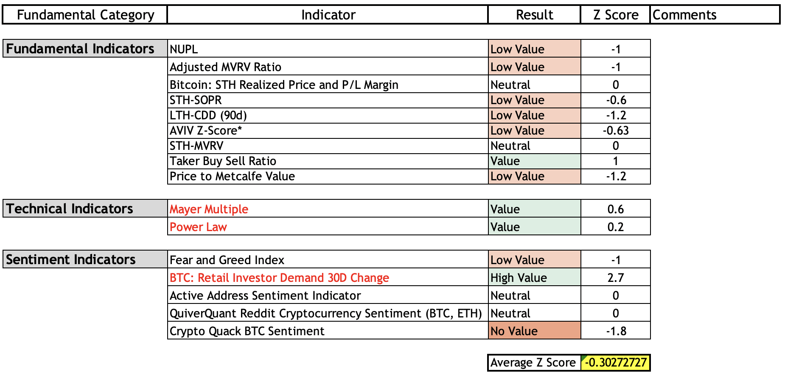
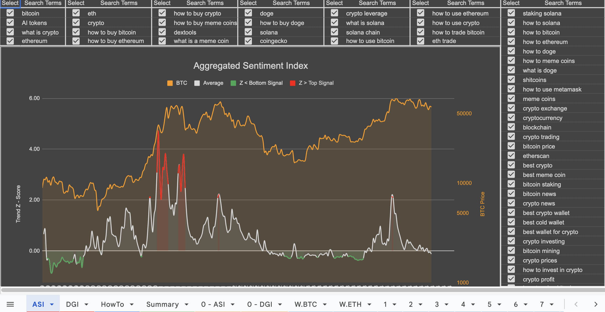

# Medium-Term Investment Strategy

## Technical Analysis
Trend-following strategy built and backtested in TradingView.  
The trend is determined by aggregating open-source trend-following indicators.  
Spot positions are entered if the strategy signals long AND market valuation is supportive of positive price performance.  
If the strategy signals short, cash or stablecoins are held.  

  

## Market Valuation
Determines whether the market environment is supportive of price performance.  
This system aggregates several key on-chain metrics, fundamental indicators, and sentiment indicators that are considered to have a predictive value for Bitcoin's price movements.  
This aggregate score is mean-reverting and signals overbought and oversold conditions.  

The Sentiment indicator queries CoinAPI for market data and GoogleTrends for the amount of google searches for a set of cryptocurrency terms. The search frequency of cryptocurrency terms can be indicative of retail sentiment. Below is a screenshot of an early version of this indicator.

  
  

